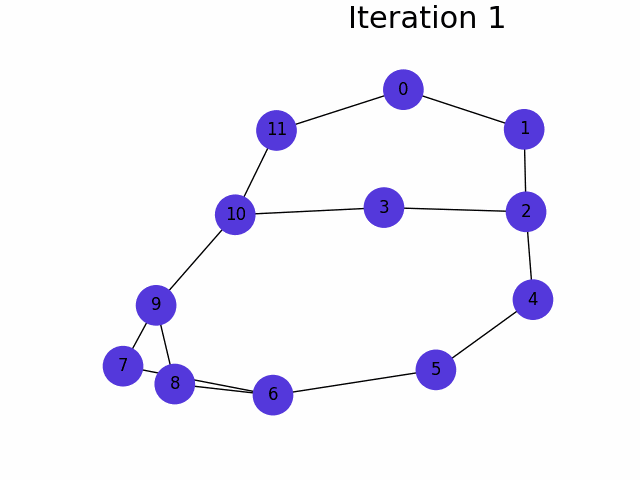

# Distance-2-coloring
Implementation of efficient self-stabilizing distance-2 coloring algorithm described in the article "An efficient self-stabilizing distance-2 coloring algorithm", written by Jean R.S. Blair, and Fredrik Manne.

## Running the algorithm
In order to run the coloring algorithm, run the `coloring.py` script, for example:
```py coloring.py```.

It will generate the `images` directory, containing the images corresponding to the coloring of the graph in each step of the algorithm.

## Generating animation
In order to generate an animation of the coloring process, run the `animation.py` script, for example:
```py generate_animation.py```.

It will generate the `animation.gif` file, based on the files from the `images` directory, containing the animation of the coloring process.

## Example
The following example shows the application of the algorithm in order to color the graph with 12 nodes.


